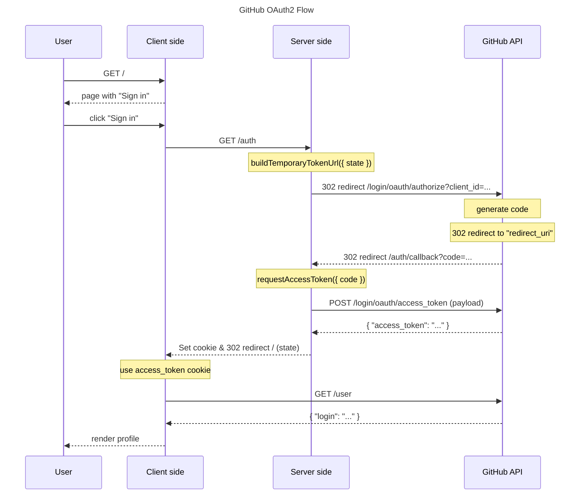

# oauth-client-github

[](https://www.npmjs.com/package/oauth-client-github)
[](https://badge.fury.io/js/oauth-client-github)
[](https://www.npmjs.com/package/oauth-client-github)
[](https://packagephobia.com/result?p=oauth-client-github)
[](https://piecioshka.mit-license.org)
[](https://github.com/piecioshka/oauth-client-github/actions/workflows/testing.yml)

🔐 Zero-dependency OAuth 2.0 client for GitHub

> Give a ⭐️ if this project helped you!

## Features 🚀

- 📦 Zero runtime dependencies _(built on the native `fetch`)_
- ⚡ Two-method API: `buildTemporaryTokenUrl()` and `requestAccessToken()`
- 🧩 Framework-agnostic _(works with Express, Fastify, or bare `node:http`)_
- 📘 TypeScript types included out of the box
- 🔒 Supports the `state` parameter to prevent CSRF attacks
- 🧪 Covered by unit tests running in CI

## Why? 🤔

Passport and similar middlewares hide the OAuth flow behind framework-specific
plugins. This package does the opposite: two explicit functions that map 1:1 to
the two steps of the OAuth 2.0 authorization code flow, so you see exactly what
happens between your app and GitHub.

## Preview 🎉

<https://oauth-client-github-demo.vercel.app/>


💡 Source code of this app in [demo/](/demo/) directory.

## Usage

Installation:

```bash
npm install oauth-client-github
```

```javascript
// server.js
const oauthClientGitHub = require("oauth-client-github");

const githubAuth = oauthClientGitHub.init({
  client_id: "",
  client_secret: "",
  redirect_uri: "<host>/auth/callback",
  scope: "", // user, repo, gist, notifications, read:org, etc.
});

app.get("/auth", async (req, res) => {
  const state = req.headers.referer;
  const url = await githubAuth.buildTemporaryTokenUrl({ state });
  // Redirect to GitHub OAuth page to authorize a user
  res.redirect(url);
});

app.get("/auth/callback", async (req, res) => {
  const { code, state } = req.query;
  const response = await githubAuth.requestAccessToken({ code });
  // Create a cookie to use it on the client-side
  res.cookie("token", response.access_token);
  res.redirect(state ? String(state) : "/");
});
```

```javascript
// client.js
const access_token = document.cookie.split("=")[1];

const response = await fetch("https://api.github.com/user", {
  headers: {
    Authorization: `Bearer ${access_token}`,
  },
});
const user = await response.json();
console.log({ user }); // A user with private data! 🎉
```

## Specification

Sequence diagram with the _OAuth 2.0 flow for GitHub_:



## Prerequisites: Create new OAuth App

1. Open a page: https://github.com/settings/developers and click on the "New OAuth App"
2. Fill the form:

- Application name _(required)_
  - eg. `oauth-client-github`
  - _TIP: it will be visible only for you_
- Homepage URL _(required)_
  - eg. `https://example.com`
  - _TIP: it will be visible only for you_
- Application description _(optional)_
- Authorization callback URL _(required)_
  - eg. `http://localhost:3000/auth/callback`
  - _TIP: you need to put real URL to your app_
  - ⚠️ This field will be cross-checked with your param `redirect_uri`
- Enable Device Flow _(optional)_

3. Generate a new client secret by clicking on the "Generate a new client secret"
4. Copy secret and save to config file (like `.env`):
   - Client ID
   - Client Secret

## Parameters

- `client_id` - GitHub App Client ID
- `client_secret` - GitHub App Client Secret
- `redirect_uri` - URL to redirect after authorization
- `scope` - List of scopes separated by comma
- `state` - Random string to prevent CSRF attacks (optional)
  - Or it could be a referer to redirect user to the same page after authorization
- `code` - Temporary code to exchange to the access token
- `access_token` - Access token to make requests to GitHub API

## Development

```bash
# to rebuild dist/ & types/
npm run watch # or `npm run build` to build once

# to rebuild demo/dist/
cd demo/
npm run dev
```

## Resources

- [GitHub Docs: App creation guide](https://docs.github.com/en/apps/oauth-apps/building-oauth-apps/creating-an-oauth-app)
- [GitHub Docs: Scopes definition](https://docs.github.com/en/apps/oauth-apps/building-oauth-apps/scopes-for-oauth-apps)

## License

[The MIT License](https://piecioshka.mit-license.org) @ 2024
